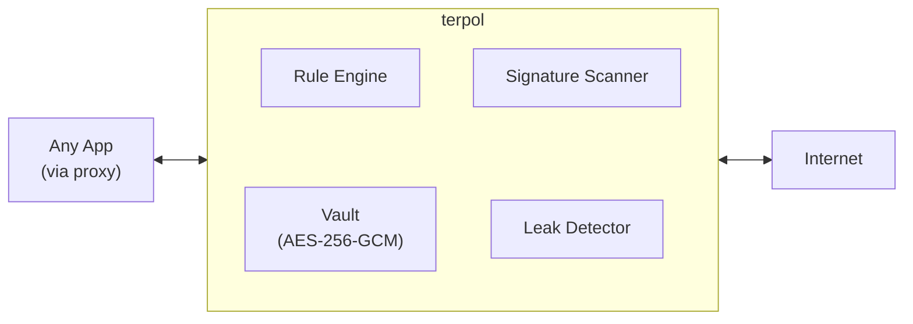

# terpol

A MITM proxy that injects secrets from an encrypted vault into network requests. Apps send requests with placeholder signatures like `%%VAULT[API_KEY]%%` — terpol intercepts matching traffic, resolves the secrets, and forwards the real values. Secrets never touch app code or config files.

## How It Works



1. Request arrives at the proxy
2. For HTTPS: domain is checked against the MITM allowlist — only allowlisted domains are decrypted
3. Rules match on domain, method, path, and target (header, body, URL, query)
4. Signature scanner finds `%%VAULT[KEY]%%` patterns and replaces them with vault values
5. Leak detector warns if signatures appear in non-matched traffic

## Quick Start

```bash
# Install via Homebrew (macOS / Linux)
brew install dakdevs/terpol/terpol

# Or install from source
cargo install --path .

# Initialize config, vault, and CA certificate
terpol init

# Trust the CA certificate (macOS)
sudo security add-trusted-cert -d -r trustRoot \
  -k /Library/Keychains/System.keychain ~/.config/terpol/ca.pem

# Trust the CA certificate (Linux)
sudo cp ~/.config/terpol/ca.pem /usr/local/share/ca-certificates/terpol.crt
sudo update-ca-certificates

# Add a secret to the vault
terpol secret add STRIPE_API_KEY

# Add a domain to the MITM allowlist (edit config.yaml)
# Add a rule to inject the secret (edit config.yaml)

# Start the proxy
terpol run
```

## CLI Reference

```
terpol init                        # Create config, vault, and CA certificate
terpol run                         # Start the proxy (sets system proxy automatically)
terpol run --no-system-proxy       # Start without setting system proxy
terpol run --daemon                # Run as background daemon

terpol secret add <KEY>            # Add a secret (prompts for value)
terpol secret remove <KEY>         # Remove a secret
terpol secret list                 # List secret names (never values)

terpol rule list                   # List configured rules
terpol rule remove <NAME>          # Remove a rule

terpol domain add <PATTERN>        # Add MITM domain
terpol domain list                 # List MITM domains
terpol domain remove <PATTERN>     # Remove MITM domain

terpol ca export                   # Print CA cert to stdout
terpol ca export -o cert.pem       # Export CA cert to file
```

Global option: `--config-dir <PATH>` overrides the default config directory (`~/.config/terpol`).

## Config Reference

Config lives at `~/.config/terpol/config.yaml`:

```yaml
signature:
  prefix: "%%VAULT["       # Start delimiter for vault references
  suffix: "]%%"            # End delimiter

mitm:
  domains:                 # Only these domains get HTTPS decryption
    - api.stripe.com
    - api.openai.com
    - "*.internal.corp"    # Glob patterns supported

proxy:
  listen: "127.0.0.1:8080" # Proxy listen address

rules:
  - name: stripe-api-key          # Human-readable rule name
    secret: STRIPE_API_KEY         # Vault key to resolve
    domain: api.stripe.com         # Domain glob to match
    method: POST                   # HTTP method (* = any, default)
    path: "/v1/*"                  # Path glob (* = any, default)
    target: header                 # Where to scan: header | body | url | query
    header_name: Authorization     # Required when target = header
    on_missing: block              # block (default) = 502 | passthrough = forward unchanged
```

## Rule Engine

Rules control which requests get secret injection. Each rule matches on four dimensions:

| Field | Description | Default |
|-------|-------------|---------|
| `domain` | Glob pattern against request hostname | required |
| `method` | HTTP method (exact match or `*`) | `*` |
| `path` | Glob pattern against request path | `*` |
| `target` | Which part to scan: `header`, `body`, `url`, `query` | required |

When a request matches a rule, terpol scans the specified target for signature patterns and replaces them with vault values.

**`on_missing` behavior** — what happens when a referenced vault key doesn't exist:
- `block` (default): Returns HTTP 502, preventing raw signatures from leaking
- `passthrough`: Forwards the request unchanged

## System Proxy

By default, `terpol run` configures the OS-level HTTP/HTTPS proxy so all applications route through terpol automatically.

- **macOS**: Sets proxy via `networksetup` on all active network services
- **Linux**: Sets `http_proxy` / `https_proxy` environment variables

On shutdown (or Ctrl+C), the original proxy settings are restored.

Use `--no-system-proxy` to skip this and configure `HTTP_PROXY`/`HTTPS_PROXY` manually.

## Security

- **Vault encryption**: AES-256-GCM with key derived via Argon2id from your master password
- **CA certificate**: Generated locally on `terpol init`, never leaves your machine
- **Selective MITM**: Only domains in the allowlist are decrypted — all other HTTPS passes through as an opaque tunnel
- **No secret logging**: Secret values are never written to logs. Only key names appear in log output
- **Leak detection**: Warns when signatures appear in traffic that doesn't match any rule

## License

MIT
